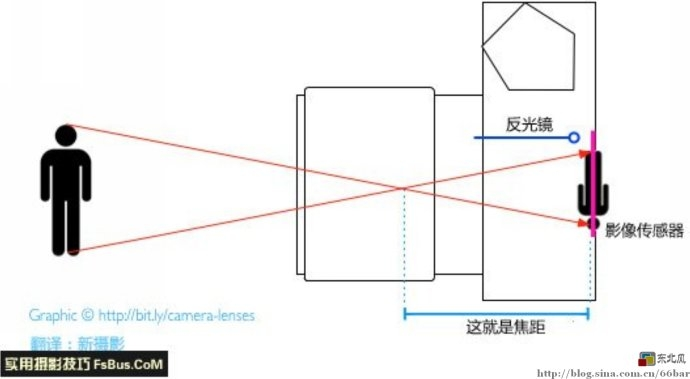
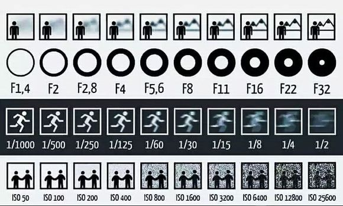

# CameraChronicles
我想要培养摄影的爱好，因此我创建了一个记录硬件参数和学习历程的GitHub仓库。

## 1.相关参数

- 光圈，用F值表示，数字越小代表光圈越大（F1.4，F1.8，F3.5，F5.6，F16）
- 快门，常用时间单位是秒，通常用分数表示（1/4000 S，1/2000 S ，1/200 S， 1/60 S，1/5 S，1 S，15 S ，30S）
- ISO，滤网的大小，越大进来的杂质越多，噪点越多。（100， 200， 400， 800， 1600， 3200， 6400， 12800）
- 焦距，在光学上，这个焦点称作“节点”（译注：在同介质中，主点与节点重合）。从节点到影像传感器的距离称作“焦距”
- 景深
- 曝光

